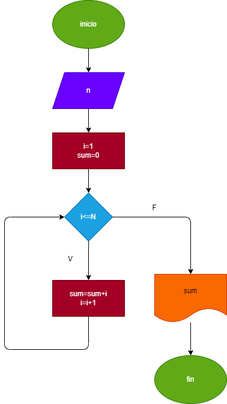

# Ejercicio 25 instruccion repetitiva
#
#Suma de los primeros 10 numeros naturales

#

# ANALISIS:
# Calcular la suma de los primeros n numeros naturales usando intrucciones repetitivas (while).
#

# Diagrama de flujo:

